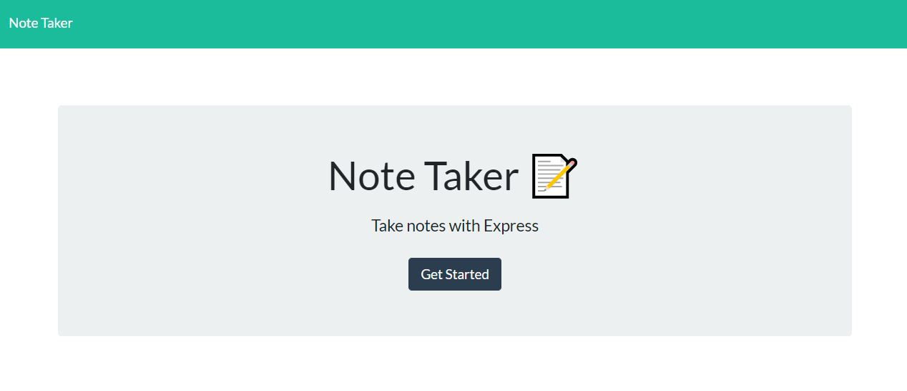
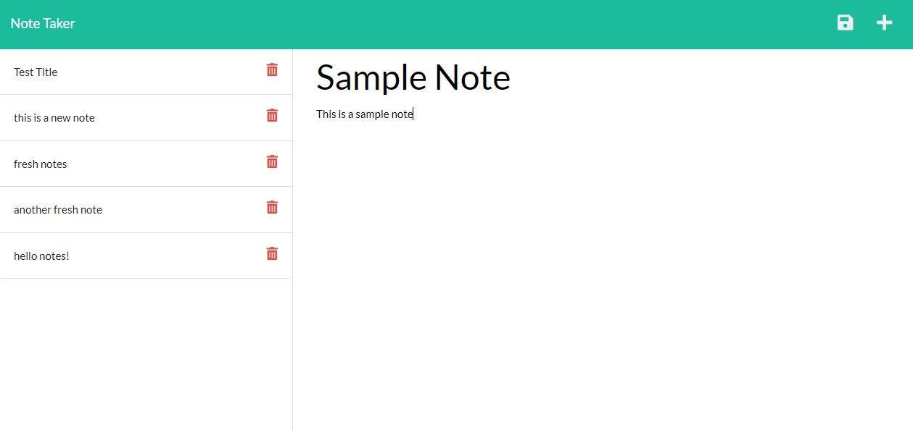
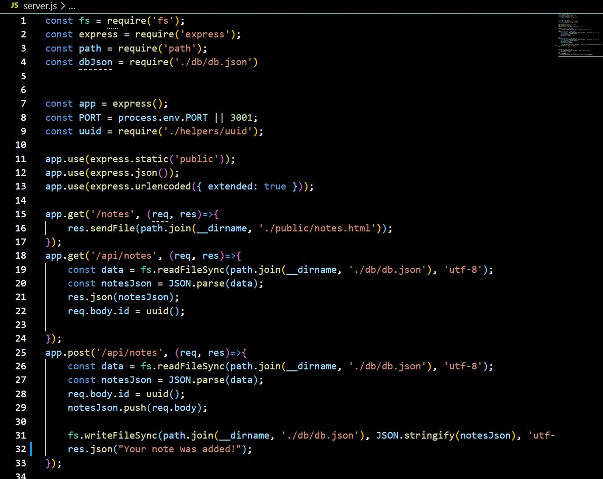

# Note-Taking-Application

## Description

This tool can be used to take and save notes within a web application. It uses express.js functionality on the back end and generate a .JSON file within the db database folder.

## Table of Contents

- [Description](#description)

- [Installation](#installation)

- [Usage](#usage)

- [Contributors](#contributors)

- [Technology](#technology)

- [Links](#links)

## Installation

The application will require an 'npm install' in order to allow functionality. Once ran, "npm start" can be used to start the server. The completed application is also hosted on the heroku server network.  

## Usage

This application should be used to easily create and keep track of notes using a web-based application. 

Usage and Code Examples:

## Contributors

[Felix Petzsche GitHub Link](https://github.com/felix1805).

## Technology

This application uses javascript, JEST, HTML, node.js scripting, node package management and inquirer. 

## Links

[GitHub Link](https://felix1805.github.io/Note-Taking-Application/).

[Heroku Link](https://sheltered-sands-52656.herokuapp.com/).